# ES2 - Integrantes do Grupo

Este repositório pertence à disciplina **Engenharia de Software 2 (ES2)**.  
Abaixo estão listados os integrantes do grupo e seus respectivos perfis no GitHub.

## Integrantes

- [Artur Kioshi de Almeida Nacafucasaco](https://github.com/ArturKioshi)
- [Breno Dias Arantes dos Santos](https://github.com/breninhoinho)
- [Pedro Marchi Nunes](https://github.com/PedroMarchiN)
- [Leonardo Ryuiti Miasiro](https://github.com/LeonardoMiasiro)

## I - Relatório de Cobertura de Código dos Testes Automatizados Existentes

Esta seção documenta a geração dos relatórios de cobertura de código dos testes automatizados existentes, utilizando a biblioteca **c8** integrada ao **Mocha** que já estava no projeto.

### Como Gerar o Relatório

Basta utilizar o comando abaixo:

```bash
npm test
```

O relatório HTML detalhado será gerado automaticamente no diretório:
`tmp/coverage/index.html`

### Resultados Atuais

Abaixo estão os resultados da execução atual, evidenciando as métricas Branches, Functions e Lines.

**1. Visão Geral do Projeto**
A cobertura global atual é de aproximadamente **36%** nas instruções.

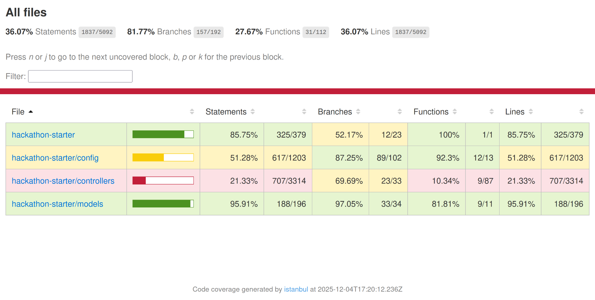

**2. Detalhamento: Controllers**
A pasta `controllers` apresenta baixa cobertura em arquivos críticos como `api.js` e `user.js`, indicando áreas prioritárias para novos testes.

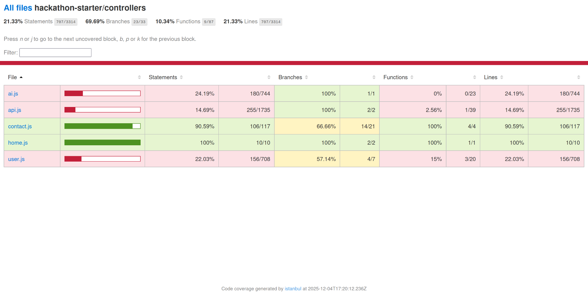

**3. Detalhamento: Config**
Na pasta `config`, o arquivo `passport.js` representa a maior oportunidade de melhoria na cobertura de testes.

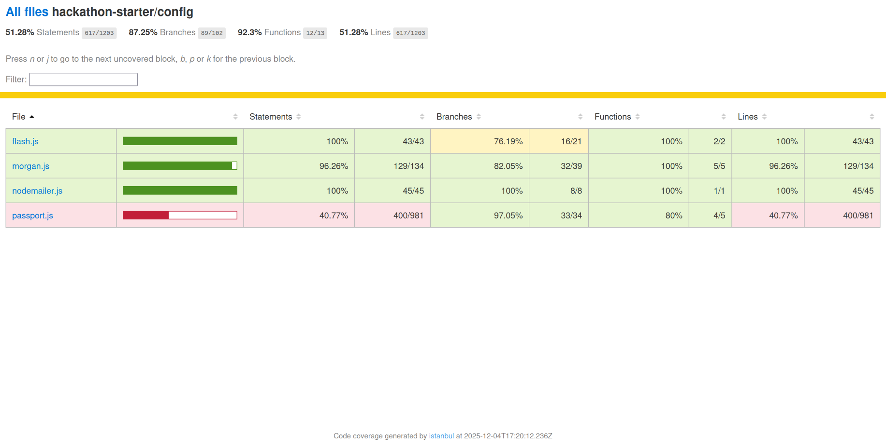

## H - Testes Manuais (GUI)

Esta seção documenta a execução de testes manuais exploratórios e funcionais na interface gráfica (GUI) da aplicação Hackathon Starter. O objetivo foi validar a usabilidade, a navegação e o comportamento dos principais, utilizando critérios de validade de links, renderização de layout e resposta de formulários.

### Metodologia e Cenários Testados

Os testes foram conduzidos em ambiente local (`localhost:8080`), como não há de fato um "usuário final", visto que o projeto se trata de um template para hackathons, foram conduzidos testes exploratórios, verificando as funcionalidades oferecidas.

1.  **Navegação Geral:** Verificação da responsividade da Home Page, funcionamento da barra de navegação (Navbar) e rodapé.
2.  **Autenticação:** Telas de Login e Cadastro.
3.  **Funcionalidades de API:** Navegação pelo catálogo de APIs, acesso às telas de detalhe e verificação da validade dos links externos (ex: redirecionamento para documentação oficial).
4.  **Funcionalidades de IA:** Acesso ao painel de exemplos e testes de interface no módulo RAG (Retrieval-Augmented Generation).
5.  **Formulários:** Submissão do formulário de contato para validar o comportamento dos campos obrigatórios e feedback visual.

### Evidências de Teste

#### 1. Navegação e Home Page

A página inicial carregou corretamente, com todos os elementos de cabeçalho, rodapé e botões de ação ("View details") funcionais.
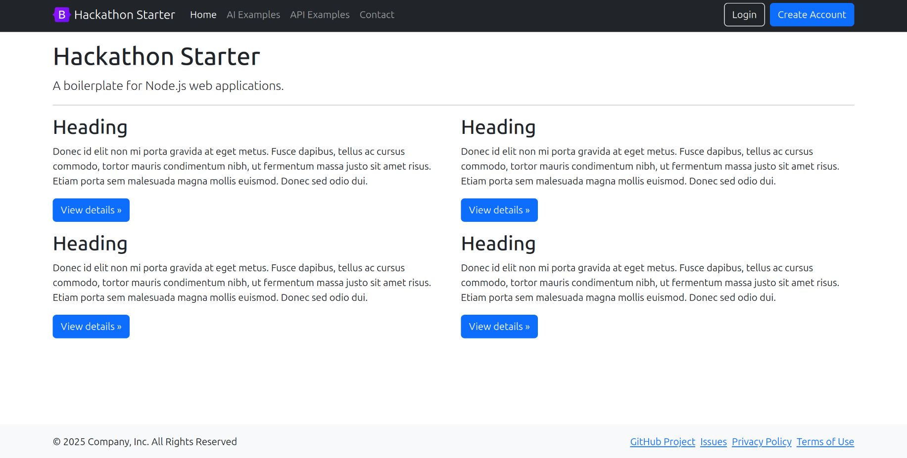

#### 2. Fluxo de Autenticação

As telas de Login e Cadastro (Sign Up) apresentaram layout sem muita complexidade. As validações de campo não checavam respostas vazias ou senhas diferentes automaticamente. Todavia, todos os botões de "Sign in" utilizando outra plataforma funcionaram.

|                   Login                    |              Cadastro (Sign Up)               |
| :----------------------------------------: | :-------------------------------------------: |
| 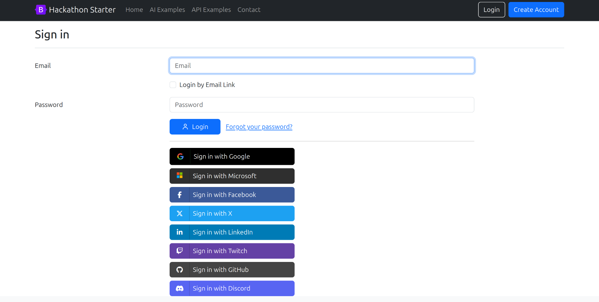 | 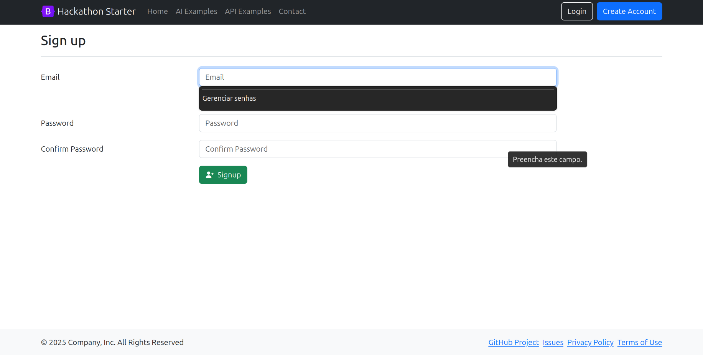 |

#### 3. Catálogo de APIs

A listagem de APIs foi exibida corretamente. Ao acessar detalhes (ex: GitHub), os links de documentação e "Getting Started" estavam funcionais.

|              Lista de APIs              |          Detalhe API (GitHub)           |
| :-------------------------------------: | :-------------------------------------: |
| 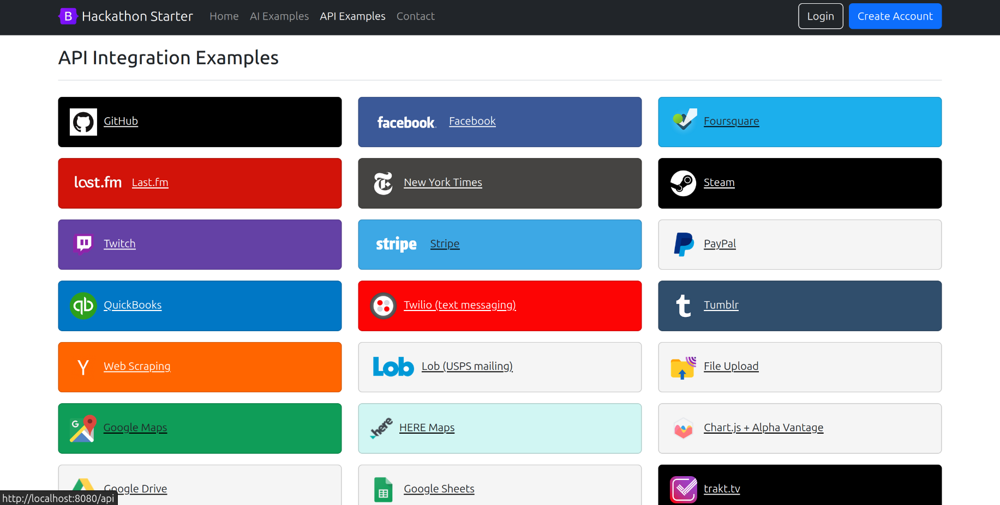 |  |

#### 4. Integrações de IA e RAG

Os exemplos de IA carregaram sem erros. Cada uma das páginas explicava como utilizar as inteligências artificiais para tarefas reais de um projeto, com links para documentação funcionais.

|               Menu IA                |              Interface RAG              |
| :----------------------------------: | :-------------------------------------: |
|  | 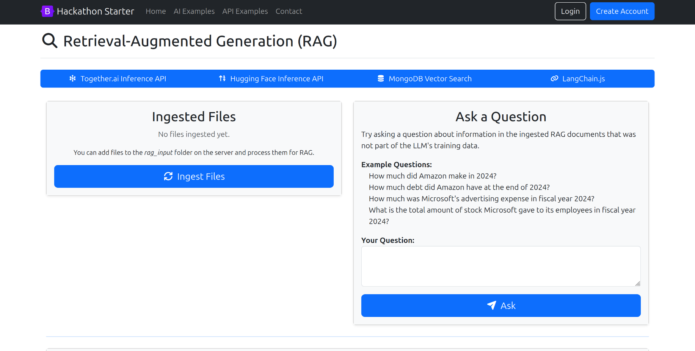 |

#### 5. Formulário de Contato

O formulário de contato exibiu corretamente os campos e verificou ao tentar enviar o email o campo, garantindo que era válido.
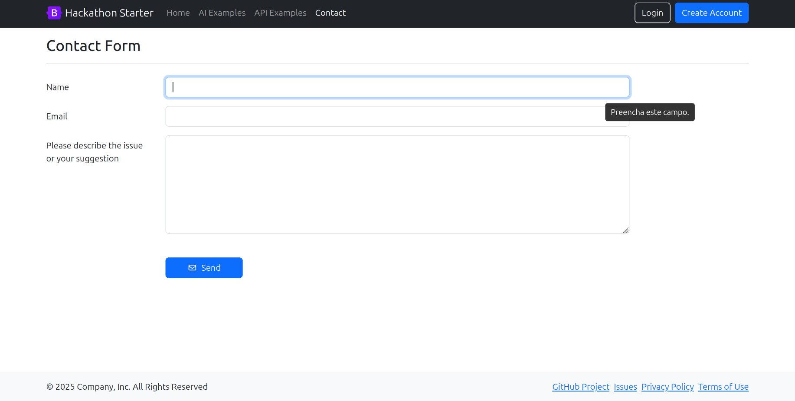

### Conclusão

O template comportou-se de maneira fluida na maior parte dos fluxos. A navegação entre as rotas ocorreu conforme o esperado.

Pontos de Atenção:

- A validação de formulários de autenticação (vazios/senhas divergentes) poderia ser aprimorada para oferecer feedback imediato ao usuário, visto que atualmente permite a tentativa de submissão.

- As integrações externas (OAuth) e links de documentação estão plenamente funcionais.

## L - Implementar casos de teste relevantes que melhorem a cobertura de código do projeto original

Foram adicionados dois novos arquivos de teste ao projeto: **`ai.test.js`** e **`api.test.js`**.  
Eles utilizam principalmente **Mocha**, **Chai** e **Sinon** para construir testes unitários dos controllers do sistema.

## 1. Bibliotecas Utilizadas

- **Mocha (`describe`, `it`)**  
  Estrutura base dos testes, organiza blocos e casos individuais.

- **Chai (`expect`)**  
  Biblioteca de asserções usada para validar valores retornados, chamadas de funções e objetos.

- **Sinon (`stub`, `spy`, `restore`)**  
  Usada para:
  - Criar _mocks_ e _stubs_ de funções,
  - Simular comportamentos de APIs externas,
  - Substituir dependências como `fetch`, `stripe`, etc.

## 2. `ai.test.js` — Testes do Controller de IA

Este arquivo testa todas as principais rotas do controller **AI**, incluindo páginas de interface e funções de processamento que dependem de APIs externas.

### Principais funcionalidades testadas:

1. **Renderização de páginas básicas**
   - `getAi()`
   - `getOpenAIModeration()`
   - `getTogetherAICamera()`
   - `getTogetherAIClassifier()`

2. **Validação de inputs**
   - Falta de texto para moderação (`postOpenAIModeration`)
   - Falta de imagem no upload (`postTogetherAICamera`)
   - Questão vazia no sistema RAG (`postRagAsk`)
   - Campo de classificação vazio (`postTogetherAIClassifier`)

3. **Erros de variáveis de ambiente**
   - Falta de `OPENAI_API_KEY`
   - Falta de `TOGETHERAI_API_KEY`

4. **Simulação de uploads**
   - Teste de envio de imagem usando `req.file.buffer`.

### O que os testes verificam?

- Se a página correta é renderizada (`res.render.calledWith`).
- Se erros são retornados corretamente (`model.error`).
- Se o status HTTP está correto (`res.status(400)`).
- Se redirecionamentos são feitos no fluxo certo.
- Se mensagens de flash são exibidas quando necessário.

## 3. `api.test.js` — Testes do Controller de APIs

Este arquivo cobre todas as rotas relacionadas às APIs gerais do sistema, incluindo Stripe, Twilio, Upload e Scraping.

### Principais funcionalidades testadas:

1. **Renderização de páginas de API**
   - `getApi()`
   - `getStripe()`
   - `getTwilio()`
   - `getFileUpload()`

2. **Upload de arquivos**
   - `postFileUpload()`  
     — Testa tanto upload real quanto upload vazio (flash de sucesso em ambos os casos).

3. **Steam API**
   Usa `sinon.stub(global, 'fetch')` para simular todas chamadas à API da Steam:
   - Busca de jogos recentes
   - Busca de conquistas
   - Dados do perfil do usuário
   - Lista de jogos na biblioteca

### Casos tratados:

- Fluxo completo funcionando (todas APIs retornando OK)
- Jogador sem jogos recentes
- Conquistas privadas (erro 403)
- Erros de rede (testa se `next(err)` é chamado)

## 4. Novos Resultados

Abaixo estão os resultados da nova execução, evidenciando as métricas Branches, Functions e Lines.

**1. Visão Geral do Projeto**
A cobertura global atual é de aproximadamente **55%** nas instruções.

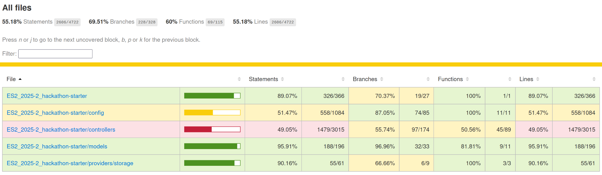

**2. Detalhamento: Controllers**

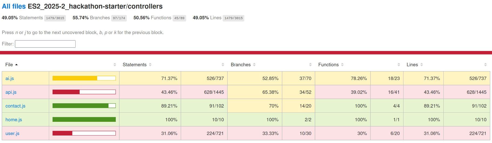

**3. Detalhamento: Config**

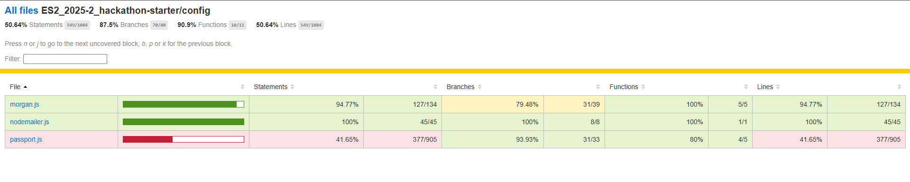

## 5. Resumo Geral

Os arquivos **`ai.test.js`** e **`api.test.js`**:

- Aumentam a cobertura de testes do projeto.
- Garantem que as rotas dos controllers continuam funcionando mesmo com mudanças internas.
- Simulam chamadas a APIs externas (OpenAI, TogetherAI, Steam, Stripe, etc).
- Validam corretamente erros, fluxos normais e cenários inesperados.
- Usam _stubs_, _mocks_, e inspeção de chamadas para assegurar que a aplicação responde como esperado.

Eles representam a base de um conjunto robusto de testes unitários para controllers de aplicações Node.js.
